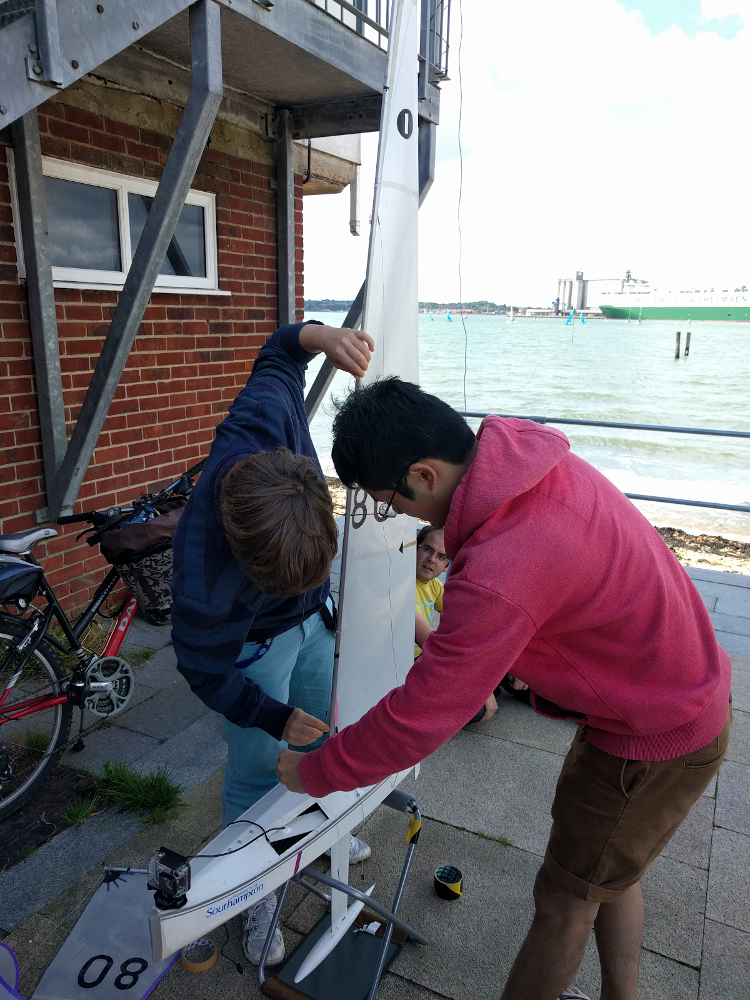
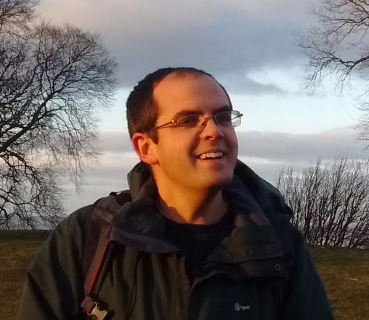

People love Python for its ease of use, breadth of modules, and vibrant community. These qualities are made possible by people like Thomas Kluyver who, during the course of his career using Python for scientific research, has identified and implemented various modules, upgrades, and enhancements to Python. He is also an active member of the Python community, attending conferences, participating in his local Python User Group, and contributing his expertise to Python Subreddits.

For these reasons, the Python Software Foundation has awarded Thomas with the Q3 2017 Community Service Award.  

RESOLVED, that the Python Software Foundation Q3 2017 Community Service Award be given to Thomas Kluyver for his contributions to the Scientific Python Community. Thomas has also served on many other open source projects and is active on the Python subreddit helping many people in the Python community.  

Contributions to Scientific Python  

Thomas earned his Ph.D. in plant biology at the University of Sheffield in England. As a scientist, Thomas’ interest in programming stemmed from childhood where he learned QBasic with support from his father. During his Ph.D. program, Thomas became a regular contributor to Jupyter/IPython, working single-handedly to port it from Python 2 to Python 3. This caught the attention of Fernando Pérez, creator of IPython and co-founder of Project Jupyter, who just happened to be looking for a post-doc. “Given his amazing contributions even while he was still a student,” says Fernando, “I was looking for an opportunity to engage him more with the project.” Thomas accepted the offer to work with Fernando at UC Berkeley developing IPython and open source tools for science. Looking back Thomas recalls, “it was a great opportunity for me.” Thomas stayed at Berkeley for 2 years before returning to England for a position at the University of Southampton. There he continues to work on Jupyter and IPython and is also involved in the [NGCM Summer Academy](http://ngcm.soton.ac.uk/summer-academy), teaching scientists a variety of computational skills in Python.  

Contributions to Other Open Source Projects  

Thomas has worked on a number of tools outside of his profession as well, such as [Flit](https://github.com/takluyver/flit). Flit is a packaging tool which aims to make it simpler to publish your Python code on PyPI. This tool and the concepts it presents have led to discussions about standard interfaces for different packaging tools to work together better, documented in PEP [517](https://www.python.org/dev/peps/pep-0517/) and [518](https://www.python.org/dev/peps/pep-0518/). Nick Coghlan, a CPython core developer who has worked with Thomas in his efforts to help move the Python packaging ecosystem forward, characterizes Thomas contributions to Flit as “rather than just writing it as a standalone tool, Thomas worked hard to ensure that the underlying interoperability standards also evolved to make it easier to write tools like Flit, and that such tools integrate nicely with frontend installation tools like pip.”  

Distributing applications to end users is still a weak point for Python, whereas distributing libraries and developer tools have become better equipped to handle this challenge in recent years. That is why Thomas built [Pynsist](https://github.com/takluyver/pynsist), a tool to build Windows installers for Python applications. Pynsist can even build a Windows installer from a Linux system, which builds on the work of other projects like [NSIS](http://nsis.sourceforge.net/Main_Page). Fernando says, “considering that Thomas is mostly a Linux user, this is a great example of how he does work that has great value to the Python community even beyond his immediate needs.”  

Contributions to the Python Community  
Thomas is a regular speaker at Python events around the world such as SciPy, PyData, EuroSciPy, and PyCon conferences. He is also involved in his local Southampton Python User Group. “Basically he's all over the community,” says Fernando, “helping others on the mailing lists, working on IPython/Jupyter, building multiple tools of great value to many, and teaching across a variety of spaces.” Fellow Jupyter/IPython developer and Flit collaborator Matthias Bussonnier agrees saying, “Thomas has always cared a lot about community and has spent hours teaching new contributors how to do things, even if it would take him less time to do them himself.”  

Why Python?  

<table cellpadding="0" cellspacing="0"><tbody><tr><td></td></tr><tr><td><a href="http://blog.sotonsailrobot.org/articles/xsens-test/">Working on the Black Python</a></td></tr></tbody></table>

When asked why Python is his language of choice, Thomas explains, “It's a beginners language, but it's also a language that many experienced programmers are using to solve real problems. I also like the breadth of domains in which Python is used and the strong open source ethos in the community around Python.”  

As if Thomas has yet to prove the full breadth of Python’s domains, Thomas recently participated in the [World Robotic Sailing Competition](http://www.roboticsailing.org/). His team entered in their model sailboat, named the Black Python, which carries a Raspberry Pi to control the sails and the rudder. The Black Python took first place in the 'micro sailboat' class both this year and last. Read more about this project on their [blog](http://blog.sotonsailrobot.org/).  

Despite these significant accomplishments, Thomas recognizes the support he has gotten over the years recalling, “I've benefited immensely from other people: from my father helping me to learn programming, to the IPython team welcoming me and bringing me into the scientific Python community, to the thousands of programmers whose open source code I've used.”

<table><colgroup><col width="438"></colgroup><tbody><tr><td><table align="center" cellpadding="0" cellspacing="0"><tbody><tr><td></td></tr><tr><td>Community Service Award Winner 2017Q3 Thomas Kluyver</td></tr></tbody></table>

</td></tr><tr><td>
 
</td></tr></tbody></table>
