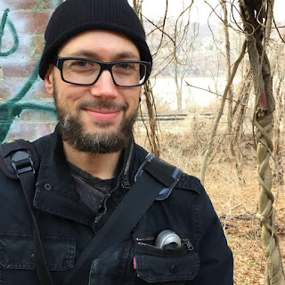

When we think of Pythonistas that have made a significant mark in the Python community there are many to consider - Python open source project maintainers, the Python core developers, or the countless Python organizers who bring Python events to new corners of the world. All these Pythonistas demonstrate the dedication and commitment it requires to make Python and the Python community work. Yet there are many whose contributions are at times less apparent, less visible. These Pythonistas are not so much hidden as intentionally working behind the scenes, offering assistance to others, so that they can take the mantle of leadership and make their own mark in the community. In more ways than one, A. Jesse Jiryu Davis has been a mentor and advocate for the community, inspiring many to take that next step in their own Python pursuits. It is for this reason that the Python Software Foundation recognizes [A. Jesse Jiryu Davis](https://twitter.com/jessejiryudavis?lang=en) with a [Q4 2017 Community Service Award](https://www.python.org/community/awards/psf-awards/#december-2017):

> RESOLVED, that the Python Software Foundation award the Q4 2017 Community Service Award to A. Jesse Jiryu Davis for the work he does on the PSF blog, his outreach & education efforts, and for organizing PyGotham 2017.

### Coders aren’t good communicators … right?

Our paths into Python are varied, yet there are common themes that bring us to Python. Perhaps your workplace uses Python or perhaps Python was the obvious language to use to solve the problem you were confronted with. For others, though, we arrive at Python because of the rich documentation and friendly community. In his day to day Jesse is a staff engineer at [MongoDB](https://www.mongodb.com/). As such, Jesse has written tools for MongoDB like [Motor](http://motor.readthedocs.io/en/stable/), the async MongoDB Python driver. In his role Jesse explains, “I’m really lucky, I was hired by an open source software company who encouraged me to become a well known member of Python community by writing and speaking”. Contributing to and maintaining open source also means contributing to the documentation surrounding open source tools. While writing on the tools that Jesse helped create was an entry point into writing, Jesse recognized the unique position he had within his role, “I want\[ed\] to use this advantage to open up these opportunities to other folks”.

<table align="center" cellpadding="0" cellspacing="0"><tbody><tr><td></td></tr><tr><td>Photo by Barbara Joshin O'Hara.</td></tr></tbody></table>

Jesse actively writes on his [personal blog](https://emptysqua.re/blog/) on such topics as Python (and more broadly programming), photography, and zen as well as on several other [platforms](https://opensource.com/article/18/3/avoid-humiliating-newcomers). In his Python content Jesse has written on advanced concepts like Python’s [Global Interpreter Lock](https://emptysqua.re/blog/grok-the-gil-fast-thread-safe-python/) to content accessible to programmers of any level like [how to begin one’s public speaking career](https://emptysqua.re/blog/public-speaking-workshops-february-2018/). Crafting accessible and open content has been a way that Jesse has be able to channel his position into learning opportunities for others (for example, see Jesse’s PyCon 2016 talk “[Write an Excellent Programming Blog](http://pyvideo.org/pycon-us-2016/a-jesse-jiryu-davis-write-an-excellent-programming-blog-pycon-2016.html)”).

Another location Jesse actively writes in on the Python Software Foundation [blog](http://pyfound.blogspot.com/). Part of formerly a team of three bloggers, Jesse has been a blogger for the PSF since early 2016. Often the work on the PSF blog requires individuals to do extensive research and interviews on Pythonistas and communicate critical Python [news](http://pyfound.blogspot.com/2017/01/time-to-upgrade-your-python-tls-v12.html). On-boarding individuals requires a careful attention to detail and countless hours of review and back and forth as all the work happens remotely in a decentralized fashion. PSF blogger Christy Heaton joined the Python Software Foundation blogging team in late 2016, “I have considered Jesse a mentor since I began blogging for the PSF. When I got my first assignment, and wasn't sure where to start,” she recalls. “Jesse took the time to thoughtfully detail his process for me, in an ego-less and judgement-free way. Now the process is so natural, and I have Jesse to thank for that!”

### Sharing the Wealth: Empowering Others to Speak and Share in the Python Community

Jesse’s writing isn’t the only mechanism he’s used to empower others. One of the open questions Jesse was interested in exploring as a PyGotham 2017 organizer included the question of how to reach more underrepresented folks to submit and speak at PyGotham. Part of this exploration included participating in a PyLadies NYC panel to discuss the CFP process, discuss example submissions, and learn more about what challenges confronting individuals when submitting talks.

The event inspired Jesse to spearhead a unique opportunity for PyGotham -- discover a way for new speakers to have access to professional speaker coaching. “Speaking and writing are side gigs for programmers. We are expected to be good at them, if we are then that’s beneficial for our careers. Often, though, we don’t know what we are doing. There are many writers and speakers outside tech that are highly skilled and underpaid, and we are often overpaid so there is an opportunity to share this wealth,” Jesse explains. Jesse’s own speaking coach, [Melissa Collom](http://melissacollom.com/), is a professional opera singer and Jesse attributes much of his own success in becoming a storyteller, as she has helped him learn how to use his voice and body effectively to make him a compelling speaker. Melissa comments that the “same things that make me an effective performer are the same things that make someone an effective communicator". Therefore when it comes to public speaking Melissa believes that there is a “plurality of excellences, finding the most authentic expression of you means finding what works best for you".

Based upon this belief that there are complementary skill sets in the world and that it’s often by working together that we as individuals can find our “plurality of excellence”, Jesse set about fundraising to ensure that there would be an ability for [11 new PyGotham speakers to have access to a speaking coach](https://emptysqua.re/blog/coaching-for-first-time-pygotham-speakers/). “The thing that stands out to me \[about Jesse is he\] believes in mentorship and he is a feminist. Jesse believes that women and non-binary people \[should\] have a place at the table. He is willing to leverage his privilege to help pull some extra chairs up to the table,” Melissa says when describing Jesse.

Additionally Jesse has worked outside of the conference space to help others in developing their pubic speaking careers. “I appreciate Jesse as an educator and mentor in the Python world. His conference talks are educational, engaging, and thought-provoking. Jesse enjoys sharing his knowledge with others and paying it forward. He is a true ally,” former Python Software Foundation Director and PyLadies Remote Organizer [Anna Ossowski](https://twitter.com/OssAnna16) shares. In February 2018 as a part of the [Global Diversity CFP Day](https://www.globaldiversitycfpday.com/) PyLadies Remote invited Jesse to share his expertise in and personal journey into public speaking and writing. “I am thankful for Jesse taking the time to teach PyLadies Remote classes for us, as well as for his help with my talk proposals,” Anna concludes.

We All Have Something to Contribute: What will you contribute?

The theme that emerges time after time when speaking with those that have worked with Jesse is his selflessness and desire to leave more behind than he may take. Director of Python Software Foundation Operations Ewa Jodlowska shares, “I’ve known of Jesse for many years due to his contributions to the Python community. What stands out the most is the willingness to help others.” From his writing, to his speaking, to his mentoring, to his open source projects ([that begs us to question our privilege and social location](https://www.proporti.onl/)), to his relentless advocacy Jesse demonstrates the richness of the Python community in our shared values of contributing often and freely sharing. That said, we all have something to contribute to the Python community, what will your contribution be?
