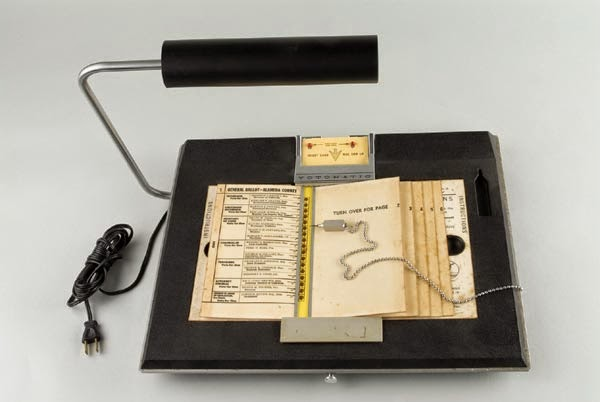

# Earlier this month, the PSF opened an election on two issues: the first was a straightforward vote on the adoption of new Sponsor Members; the second was more experimental: a non-binding vote for the membership to weigh in on a complex issue to be decided by the Board. This poll was part of the larger project (featured in several recent blog posts, see, for example, [Let’s Make Decisions](http://pyfound.blogspot.com/2015/03/personal-opinion-i-think-its-always.html) to make the PSF a more inclusive, diverse, and democratic organization.

#  Source: National Museum of American History. PD-USGOV The election was closed yesterday, March 26th. The results can be found at [Election 9 Results](https://vote.python.org/init/default/results/9) and are as follows: Sponsor Members, Bloomburg LP, Fastly and Infinite Code were all voted in by large margins.

| Sponsor Member Candidates | yes | no | abstain |
| --- | --- | --- | --- |
| Bloomberg LP | 174 | 7 | 28 |
| Fastly | 193 | 3 | 13 |
| Infinite Code | 147 | 13 | 49 |

The second issue:

> The PSF Board of Directors is seeking the collective perspective of PSF Voting Members on the appropriate handling of video recording sublicensing for presentations at PyCon US (see [Membership Vote](http://pyfound.blogspot.com/2015/03/membership-vote.html)).

This poll sought members' views along two dimensions of the sublicensing issue: the entities to whom licenses should be granted; and the timeframe of the videos to be licensed. The results of the poll were quite divided. **Sublicense entities**

| Only YouTube (others embedding) | As many mirrors as possible | Only non-commercial mirrors |
| --- | --- | --- |
| 17 | 104 | 68 |

**Sublicense timeframe**

| Prospectively only | Including retroactively | Not applicable |
| --- | --- | --- |
| 87 | 88 | 9 |

The PSF wishes to thank everyone who participated. This input of the membership is extremely valuable to the PSF, and this was a useful first run at use of non-binding polls. There will be a lot more discussion around this topic while the Board continues to weigh pros and cons prior to making the decision that best supports the interests of the membership. Please feel free to comment on this Blog, on Twitter, to the PSF (or in the *Hallway Track* in Montreal). *I would love to hear from readers. Please send feedback, comments, or blog ideas to me at [msushi@gnosis.cx](mailto:msushi@gnosis.cx).*
