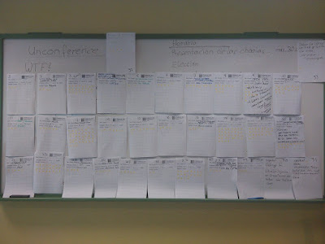
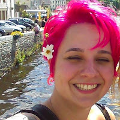
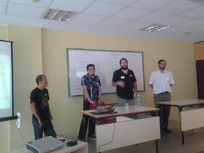

*Note: This is the third post on my trip in April to Havana, Cuba to attend the International Open Software Convention, [CubaConf](https://www.cubaconf.org/espa%C3%B1ol/).* The second day of CubaConf, structured as an [unconference](https://www.cubaconf.org/schedule/day-2-unconference/), was equally as lively as the first. In an unconference, the audience actively participates by proposing topics and then voting on which ones will be presented. This was especially effective as a way of conforming to the conference’s purpose to explore ways in which open software can be most effectively used in poorer nations, like Cuba, and how it can contribute to development. I was impressed by the number of audience members who came prepared to give a talk and who lined up at the front of the room to pitch their ideas. The suggestions were recorded on a white board, and at the end of the session we voted for the agenda.

<table align="center" cellpadding="0" cellspacing="0"><tbody><tr><td></td></tr><tr><td>Proposed unconference topics</td></tr></tbody></table>

Before moving on to the unconference talks, we heard an already scheduled keynote. [Etiene Dalcol](https://www.cubaconf.org/2016/01/05/second-keynote-speaker-etiene-dalcol-will-talk-about-growing-through-free-software-and-lua/), a Brazilian software engineer, told us of her experiences and observations within the tech scene in Brazil. Early on in her career, Dalcol created a web framework, [Sailor](http://sailorproject.org/), in ten days. She said that although it was lousy, people began to contribute and to request more features, indicating their thirst for local grown tech. Sailor is now quite improved and popular, and will be participating for its second time in [Google’s Summer of Code](https://summerofcode.withgoogle.com/). Dalcol then talked about her experiences working on the programming language, [Lua](https://www.lua.org/about.html). She used the history of Lua to illustrate what she sees as a hindrance to tech development in Latin America. Lua, created in 1993 in Brazil, was never marketed in Brazil. In fact, it wasn’t until 2015 that the first Portuguese language book on Lua was published. According to Dalcol, this type of suppression of local efforts contributes to a belief, prevalent even among Brazilian engineers, that Silicon Valley tech is superior.

<table cellpadding="0" cellspacing="0"><tbody><tr><td></td></tr><tr><td>Etiene Dalcol</td></tr></tbody></table>

To combat this situation, her advice for Latin American developers is to stay true to their own unique perspectives and needs; to develop software that will solve local problems and to offer products that reflect their own cultures–to do what can’t be done anywhere else. In fact, according to Dalcol, this approach will produce software that will in turn be of benefit to other cultures. She cited advice she had found useful as a musician--don't play Chopin to Europeans; rather offer them what you know but they don't. Dalcol also spoke of her experiences as a woman in tech, a theme that was addressed head-on later in the conference in its final keynote on women in open source (more on this later). Dalcol’s advice was clearly reflected in many of the afternoon’s unconference talks. We heard from participants about projects that were actively benefiting their communities. One such talk, by a developer from Costa Rica, was about the use of [Open Street Map](https://www.openstreetmap.org/about). OSM allows collaborators to create interactive maps geared to specific purposes. Examples included Ecuador’s rapid mapping of areas of damage caused by the devastating earthquake that had just happened April 26. By the following Sunday, just five days after the quake, nine cities had been completely mapped, providing crucial information for emergency responders, survivors, and reconstruction workers. Other OSM projects discussed included a public transport map in Nicaragua and a map of humanitarian services in Costa Rica. There have even been open street mapping parties in Indonesia to develop useful maps. The speaker invited participants to join his open source mapping workshop to be held the next day.

<table align="center" cellpadding="0" cellspacing="0"><tbody><tr><td></td></tr><tr><td>Open Street Mappers</td></tr></tbody></table>

Another day two talk, by [Tony Wasserman](https://www.cmu.edu/silicon-valley/faculty-staff/wasserman-tony.html) on evaluating technology for business needs was well-received by many who had entrepreneurial intent and appreciated a run-down of the factors that lead businesses to adopt some software products over others. At day’s end, we gathered in the main room for Lightning Talks and announcements. It was clear that the day had generated a great deal of excitement that would carry over to the next day’s sprints and to projects that would continue beyond the conference. *I would love to hear from readers. Please send feedback, comments, or blog ideas to me at [msushi@gnosis.cx](mailto:msushi@gnosis.cx).*
