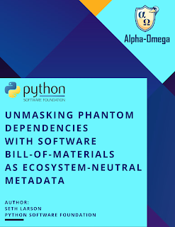

The Python Software Foundation Security Developer-in-Residence, Seth Larson, [published a new white paper](https://alpha-omega.dev/blog/unmasking-phantom-dependencies-with-software-bill-of-materials-as-ecosystem-neutral-metadata-white-paper-by-seth-larson-python-software-foundation/) with Alpha-Omega about the work to solve the "Phantom Dependency" problem. The white paper details the approach, challenges, and insights into the creation and acceptance of [PEP 770](https://peps.python.org/pep-0770/) and adopting Software Bill-of-Materials (SBOMs) to improve the measurability of Python packages.

This work means that automated systems like vulnerability scanners, compliance, and policy tools will provide accurate results, even in complicated software composition and dependency graphs that are common for scientific computing, performance-critical workloads, and artificial intelligence.

Critical projects like [numpy](https://github.com/numpy/numpy/issues/29465), [cryptography](https://github.com/pyca/cryptography/issues/12764), and [pip](https://github.com/pradyunsg/vendoring/issues/64#issuecomment-2817244181) are already evaluating adopting [PEP 770](https://peps.python.org/pep-0770/) and providing cross-ecosystem dependency information through the use of SBOMs.

The [Security Developer-in-Residence position](https://www.python.org/psf/developersinresidence/) is sponsored by Alpha-Omega. If you'd like to support improving Python at the ecosystem-scale contact sponsors@python.org to discuss sponsoring a Developer-in-Residence position.
