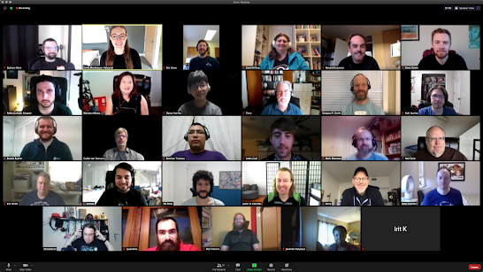

## **Overview**

From October 19th to 23rd, 47 participants gathered for the first-ever virtual 2020 Python Core Developer Sprint. This included 41 Python core developers, 3 triagers, and 3 core dev mentees. The core dev sprint is an annual week-long meeting in which the CPython core team has the opportunity to work directly together on projects and get to know one another better, free from outside distractions. Many of the core developers participating in the event received the week off from their employer to focus on the sprint.

Due to the challenges of the COVID-19 pandemic, the event had to be done remotely. This was unlike previous years, where it was hosted in-person by a sponsoring organization. While it was not exactly the same experience, it came with the silver lining of allowing participants to join the sprint from anywhere in the entire world, including those that would have otherwise been unable to travel to a physical event. Participants joined in from Canada, USA, England, Poland, Israel, China, Germany, South Korea, Japan, and the Netherlands.

Google stepped up to host the in-person event in 2020. Since that didn't work out, they were able to sponsor the virtual event so participants could receive a meal stipend for the entire week. We hope the availability of that stipend made it a more enjoyable event for participants.

## 

## Setting

The virtual event itself was hosted on [Python Discord](https://pythondiscord.com/), one of the largest and most active dedicated Python communities with over 100k members. Hosting the event on an existing Discord server allowed us to significantly simplify the setup process, obtain invaluable help from the Python Discord admin team, and create a greater audience pool for the [community Q&A](https://www.youtube.com/watch?v=gXMdfBTcOfQ). The platform choice was reached democratically through [a poll](https://discuss.python.org/t/2020-core-dev-sprint-poll-discord-or-zulip/5016?u=aeros) in the “Committers” section of [discuss.python.org](https://discuss.python.org/).

Leading up to the sprint, we created a [readthedocs site](https://python-core-sprint-2020.readthedocs.io/) as a centralized location for documentation on the sprint, links to shared docs, google calendar, project participants, Discord setup, and more. There was also a dedicated “Tech Check” day, where we set aside a full day to answer participant questions about the sprint and help them with any platform setup. Other components involved in organization of the sprint were tracked via the [python/core-sprint repo](https://github.com/python/core-sprint).

## Statistics

By the end of the sprint, we merged a total of 215 pull requests within the core Python repositories, including CPython, devguide, peps, etc. On Discord, sprint participants posted more than 5,800 messages across various channels.

The Ask a Core Dev Anything session was hosted by the Python Discord admin team and live-streamed to YouTube. It had 2,100 unique live viewers, and peaked at 385 concurrent viewers. By the end of the sprint, the session had 3,339 total viewers, with 37 countries tuned in. After the session, a number of core developers continued engaging with Python community members on Discord in the #stream-afterparty channel.

## Project Highlights

Each individual project effectively had their own sub-group, and organized internal meetings via a shared Google Calendar. Some of these projects included stdlib modules such as asyncio, importlib, pegen, ast; as well as other areas like C-API/subinterpreters, PR review, pattern matching, PEP 594 and improving new contributor experience. Here were some of the highlights for each project:

  

-   **documentation** \- Completed a Documentation Workgroup Charter to be approved by the Steering Council, which would effectively act as a committee of active documentation contributors to create goals for large projects, work through pending documentation PRs, and vote on general documentation decisions (such as the purpose and direction of the tutorial).
    
-   **asyncio** \- Initially started with a focus on a new streaming API, but was redirected to mapping out the blueprints for an upcoming exception group PEP, which would allow multiple exceptions to be simultaneously propagated for better exception handling in concurrent programs. This is intended to eventually lead to task groups in asyncio.
    
-   **importlib** \- Worked on support for namespace packages, which was a longstanding issue. Also worked through 3.10 blocker around unreleased zip file handles.
    
-   **pegen** \- Discussions around steps moving forward with migrations to the new parser. This included publishing a PyPI package with the new parser for 3rd party packages to utilize, merging a PR to make the parser faster, and porting f-strings.
    
-   **C-API/subinterpreters** - Created a PR for finishing remaining parts of PEP 573, gathering ideas for improving stable ABI, isolation of extension modules, progress towards isolating runtime state to being per-interpreter, and work on runtime finalization code.
    
-   **garbage collection** \- Discussions around prototyping a tracing garbage collector with the constraints of maximizing backwards-compatibility with existing C extensions.
    
-   **pattern matching** \- Completed drafts for PEPs 634, 635, and 636, sent to SC, and opened a draft PR for the reference implementation of those PEPs.
    
-   **core mentorship/new contributors** \- Discussions around automated welcome and first PR merged messages, incentivising contributors with 2 other reviews for one review of their own PR, automated reminders for stalled PRs, revitalization of core dev office hours, increasing core dev mentorship with documented guides.
    
-   **PEP 594** \- Discussions around moving forward with the PEP, archiving removed modules, adoption of modules from 3rd parties, and making the transition smoother for the few users who still rely on them.
    
      
    

For a more comphrehensive summary, see the [Send-off Meeting](https://www.youtube.com/watch?v=5LyGF5CwNBw).

  

## Promotions and Mentorships

The team gained two new Python triage members during the sprint: Irit Katriel and Andre Delfino. Irit has been actively contributing to CPython for the past several months. Andre has been contributing to CPython for more than two years, and already had the bug triage permission on b.p.o.

One of the mentees who participated in the sprint, Hai Shi (mentored by Victor Stinner), was later granted the bug triage privileges a month after the sprint. Batuhan Taşkaya, who was one of the bug triage members participating in the sprint, was promoted to core developer a few weeks after the sprint. Other mentees participating were Lewis Gaul and Filipe Laíns. Lewis was being mentored by Eric Snow to work on subinterpreters, and Filipe was being mentored by Jason R. Coombs to work on importlib.resources.

## Retrospective

In order to improve future sprints (especially any with a virtual component), we also asked participants at the end of the event to fill out a survey to provide feedback on parts of the sprint for parts they enjoyed and areas of improvement.

Enjoyed:

-   Usage of Discord as a platform
    
-   Unscheduled voice/video chats
    
-   Social games (such as the escape room event)
    
-   Having an agenda for large meetings
    
-   The Kick-off meeting
    
-   Dedicated off-topic channels
    

Improvements:

-   For each project, having one person as the assigned leader to schedule meetings, create an agenda, and provide a summary of accomplishments
    
-   Using a shared cloud/google drive folder instead of sharing individual documents
    
-   More automation for joining the Discord server and assigning roles
    
-   Dedicated separate server going forward to help with overload of unread channels
    
-   Maintaining a single centralized dashboard. Our [readthedocs site](https://python-core-sprint-2020.readthedocs.io/) initially started that way, but could have used more periodic updates
    
-   Swag/merchandise for the event (did not have adequate time this year)
    

## Links

-   [Kick-off Meeting](https://www.youtube.com/watch?v=Uz8CP_05aCQ)
    

-   [Python Core Dev and Community Q&A](https://www.youtube.com/watch?v=yzCitT4juGk)
    
-   [Python Steering Council and Core Dev Q&A](https://www.youtube.com/watch?v=WnkkaQhNA7U)
    
-   [Send-off Meeting](https://www.youtube.com/watch?v=5LyGF5CwNBw)
    
-   [Python Core Sprint 2020 Readthedocs](https://python-core-sprint-2020.readthedocs.io/)
    

## Thank you!

A huge thanks to:

-   Everyone who participated in the sprint
    
-   *Google* for sponsoring the event so we could provide meal stipends for the week
    
-   *Python Discord* for hosting the event, as well assisting with the live streaming and editing of the community Q&A
    
-   The *PSF* for supporting and providing infrastructure for sprint
    

  

Sprint attendees: Joannah Nanjekye, Barry Warsaw, Batuhan Taşkaya, Pablo Galindo Salgado, Mariatta Wijaya, Łukasz Langa, Senthil Kumaran, Carol Willing, Andrew Kuchling, Neil Schemenauer, Petr Viktorin, Zach Ware, Brett Cannon, Ammar Askar, Eric V. Smith, Stefan Behnel, Ned Deily, Lysandros Nikolaou, Emily Morehouse, Tal Einat, Jason R. Coombs, Hai Shi, Kyle Stanley, Terry Jan Reedy, Guido van Rossum, Ronald Oussoren, Thomas Wouters, Yury Selivanov, Steve Dower, Dong-hee Na, Christian Heimes, Larry Hastings, Eric Snow, Gregory P. Smith, Brandt Bucher, Lewis Gaul, Filipe Laíns, Mark Shannon, Inada Naoki, Paul Ganssle, Éric Araujo, Irit Katriel, Fred Drake

  

Written by: Kyle Stanley and Mariatta Wijaya
