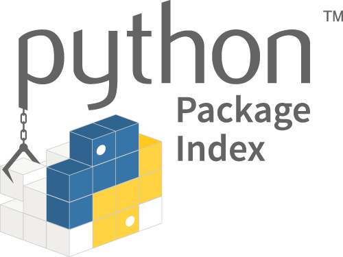

  

1.  [Context](#Context)
2.  [Migrating](#Migrating)

1.  [New PyPI Features](#new-pypi-features)
2.  [Deprecations](#deprecations)

4.  [Future Plans](#future)
5.  [Security](#security)
6.  [Please test!](#test)

1.  [Workflows](#workflows)

8.  [IRC/Twitter livechat hours](#livechat)
9.  [Contact us](#contact)

  
The all new Python Package Index is now in beta at [pypi.org](https://pypi.org/). We predict the full switch will happen in April 2018 ([roadmap](https://wiki.python.org/psf/WarehouseRoadmap)), so here's a heads-up about why we're switching, what's changed, and what to expect. To get an email when the new site replaces the old one, please sign up for [the low-traffic PyPI announcements email list](https://mail.python.org/mm3/mailman3/lists/pypi-announce.python.org/).  

## Context

  
[The legacy PyPI site at pypi.python.org](https://pypi.python.org/) started in the early 2000s, before modern web frameworks. The legacy codebase has made it hard to maintain and even harder to develop new features, even as past maintainers put in tremendous effort to continuously reduce outages. [The new PyPI at pypi.org](http://pypi.org/) (codebase: [Warehouse](http://warehouse.readthedocs.io/)) looks more modern, and is up-to-date under the hood too. A modern web framework (Pyramid), 100% backend test coverage, and a Docker-based development environment make it easier for current and new developers to maintain and run it and add features. Thanks to [Mozilla's Open Source Support funding](https://pyfound.blogspot.com/2017/11/the-psf-awarded-moss-grant-pypi.html), we have designed and added new features, overhauled infrastructure, and worked towards redirecting traffic to the new site and shutting down the old one. The full switch will include redirecting browser and pip install traffic from the old site; then, sometime in late April or early May, the legacy site will be entirely shut down.  

## Migrating

  
You may not need to change anything right away. Thanks to redirects, your sites, services, and tools will probably be able to seamlessly switch to the new site. **Users**: On Windows and Linux, no change is necessary as long as your version of OpenSSL supports TLSv1.2. pip install should work as normal. macOS/OS X users running version 10.12 or older need to upgrade to [the latest pip (9.0.3)](https://pypi.org/project/pip/9.0.3/) to connect to PyPI securely:  
curl [https://bootstrap.pypa.io/get-pip.py](https://bootstrap.pypa.io/get-pip.py) | python **Package maintainers**: If you use setup.py upload to [upload releases](https://packaging.python.org/tutorials/distributing-packages/#uploading-your-project-to-pypi), we recommend you switch to [Twine](https://pypi.org/project/twine/). New PyPI takes the same username/password as legacy PyPI did. If you have problems, follow [the packagers' migration guide](https://packaging.python.org/guides/migrating-to-pypi-org/). **API users**: follow [the API users' migration guide](https://warehouse.readthedocs.io/api-reference/integration-guide/#migrating-to-the-new-pypi). If you're affected by a deprecation (below), you should adapt and migrate by early April 2018. For help, come to [a livechat](https://wiki.python.org/psf/PackagingWG/PyPIBetaAnnouncement#IRC.2FTwitter_livechat_hours) or [contact us](https://wiki.python.org/psf/PackagingWG/PyPIBetaAnnouncement#Contact_us). Sign up for [the low-traffic PyPI announcements email list](https://mail.python.org/mm3/mailman3/lists/pypi-announce.python.org/)to get a heads-up when we have a more precise date.  

### New PyPI Features

-   mobile-responsive UI
-   chronological release history for each project ([example](https://pypi.org/project/pip/#history))
-   easy-to-read project activity journal for project maintainers
-   better search and filtering
-   support for multiple project URLs (e.g., [for a homepage and a repo](https://packaging.python.org/tutorials/distributing-packages/#project-urls))
-   [support for Markdown READMEs for source distributions](https://dustingram.com/articles/2018/03/16/markdown-descriptions-on-pypi) ([soon](https://github.com/pypa/warehouse/issues/869#issuecomment-374425355): wheels too)
-   user-visible Gravatars and email addresses for maintainers
-   no need to "register" a project before initial upload
-   better accessibility ([and more work to come](https://github.com/pypa/warehouse/labels/accessibility))
-   newer backend infrastructure, supporting new features and a more scalable PyPI

### Deprecations

  
Things that already have gone away (sometimes for policy or spam-fighting reasons) include:  

-   uploading via [pypi.python.org](http://pypi.python.org/): [uploads must go through the new site's API](https://mail.python.org/pipermail/distutils-sig/2017-July/030849.html)
-   creating a user account on [pypi.python.org](http://pypi.python.org/): [new user account registration now only on pypi.org](https://status.python.org/incidents/mgjw1g5yjy5j)
-   uploading to [pythonhosted.com](http://pythonhosted.com/) documentation hosting ([discussion and plans](https://github.com/pypa/warehouse/issues/582))
-   [download counts visible in the API](https://warehouse.readthedocs.io/api-reference/xml-rpc/#changes-to-legacy-api): instead, use [the Google BigQuery service](https://packaging.python.org/guides/analyzing-pypi-package-downloads/)
-   key management: PyPI no longer has a UI for users to manage GPG or SSH public keys
-   uploading new releases via the web UI: instead, we recommend the command-line tool [Twine](http://twine.readthedocs.io/)
-   updating release descriptions via the web UI: instead, to update release metadata, you need to upload a new release ([discussion](https://mail.python.org/pipermail/distutils-sig/2017-December/031826.html))
-   [uploading a package without first verifying an email address](https://status.python.org/incidents/mgjw1g5yjy5j)
-   [HTTP access to APIs; now it's HTTPS-only](https://mail.python.org/pipermail/distutils-sig/2017-October/031712.html)

  
Things that will go away once legacy PyPI shuts down:  

-   GPG/PGP signatures for packages (still visible in the [Simple Project API](https://warehouse.readthedocs.io/api-reference/legacy/#simple-project-api) per [PEP 503](https://www.python.org/dev/peps/pep-0503/), but no longer visible in the web UI)
-   [OpenID and Google auth login](https://mail.python.org/pipermail/distutils-sig/2018-January/031855.html)

  
Late 2018 or later:  

-   deprecating the XML-RPC API and [rearchitecting our APIs](https://github.com/pypa/warehouse/issues?q=is:open+is:issue+label:APIs/feeds)

## Future plans

  
See [our issue tracker](https://github.com/pypa/warehouse/issues). Includes:  

-   more timely package name takeovers ([PEP 541](https://www.python.org/dev/peps/pep-0541/))
-   [two-factor authentication](https://github.com/pypa/warehouse/issues/996)
-   a [user support ticket system](https://github.com/pypa/warehouse/issues/3231)
-   [change your own username](https://github.com/pypa/warehouse/issues/1190)

  
For updates, please sign up for [the low-traffic PyPI announcements email list](https://mail.python.org/mm3/mailman3/lists/pypi-announce.python.org/).

## Security

  
If you find any potential security vulnerabilities, please [follow our published security policy](https://pypi.org/security/). Please don't report security issues in Warehouse via GitHub, IRC, or mailing lists. Instead, please directly email the security team.  

## Please test!

  
The point of the beta is to find and fix bugs. Please help us. Most of these workflows you can test [on pypi.org](http://pypi.org/), using the same login as you use on [pypi.python.org](http://pypi.python.org/) (legacy PyPI). For testing destructive actions, like removing an owner, deleting a project, or deleting a release, please use [test.pypi.org](https://test.pypi.org/).  

### Workflows

  
Package users:  

-   Register/confirm a new user
-   Login/logout
-   Reset password
-   Search for projects
-   [pip install a package](https://packaging.python.org/tutorials/installing-packages/#installing-from-other-indexes)
-   Download release files via browser
-   Call JSON, RSS, Simple, and XML-RPC APIs

  
Project maintainers:  

-   Add/remove a maintainer
-   Add/remove an owner
-   Transition ownership
-   Remove a project
-   Remove a release
-   View journals for a project
-   View journals for a release
-   [Upload a new release](https://packaging.python.org/tutorials/distributing-packages/) (source distribution and wheel; [upgrade your versions of twine and setuptools](https://packaging.python.org/guides/migrating-to-pypi-org/) first)
-   Confirm display of project description, release history, download files, project links, maintainers, tags, and classifiers ([example](https://test.pypi.org/project/1234_hello_world/))

## IRC/Twitter livechat hours

  
Warehouse developers will be in IRC, in [#pypa-dev on Freenode](https://webchat.freenode.net/?channels=#pypa-dev), and on Twitter ([#newpypi](https://twitter.com/search?f=tweets&q=#newpypi&src=typd)), available to talk about problems you run into, or about how to hack on Warehouse:  

1.  Tuesday, March 27th, [9am-10am PDT, noon-1pm EDT, 18:00-19:00 CEST, 9:30pm-10:30pm India, 16:00-17:00 UTC](https://www.timeanddate.com/worldclock/fixedtime.html?msg=Warehouse/PyPI+beta+chat&iso=20180327T16&p1=:&ah=1)
2.  Friday, March 30th, [10-11am EDT, 16:00-17:00 CEST, 7:30pm-8:30pm India, 14:00-15:00 UTC](https://www.timeanddate.com/worldclock/fixedtime.html?msg=Warehouse/PyPI+beta+live+chat&iso=20180330T14&p1=1440&ah=1)
3.  Tuesday, April 3rd, [8am-9am PDT, 11am-noon EDT, 17:00-18:00 CEST, 8:30pm-9:30pm India, 15:00-16:00 UTC](https://www.timeanddate.com/worldclock/fixedtime.html?msg=Warehouse/PyPI+beta+livechat&iso=20180403T10&p1=24&ah=1)
4.  Thursday, April 5th, [5pm-6pm PDT, 8pm-9pm EDT, (April 5th) 8am-9am Manila, (April 5th) 10am-11am Melbourne, (April 5th) 0:00-1:00 UTC](https://www.timeanddate.com/worldclock/fixedtime.html?p1=24&iso=20180405T19&msg=Warehouse/PyPI%20beta%20livechat&ah=1&low=4)

  
Feel free to drop in! (By participating, you agree to abide by the [PyPA Code of Conduct](https://www.pypa.io/en/latest/code-of-conduct/).)  

## Contact us

  

-   Security issues: [email security @ python dot org](https://pypi.org/security/)
-   GitHub for all other bug reports & feature requests:[https://github.com/pypa/warehouse/issues/new](https://github.com/pypa/warehouse/issues/new)
-   IRC: [#pypa-dev on Freenode](https://webchat.freenode.net/?channels=#pypa-dev) (someone's usually there 10am-5pm Central Time on weekdays, or during [a livechat](https://wiki.python.org/psf/PackagingWG/PyPIBetaAnnouncement#IRC.2FTwitter_livechat_hours))
-   Email: [pypa-dev mailing list](https://groups.google.com/forum/#%21forum/pypa-dev)

  
(By participating, you agree to abide by the [PyPA Code of Conduct](https://www.pypa.io/en/latest/code-of-conduct/).) Thank you for using PyPI! 
