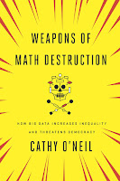

In a 1947 lecture on computing machinery, Alan Turing made a prediction: "The new machines will in no way replace thought, but rather they will increase the need for it." Someday, he said, machines would think for themselves, but the computers of the near future would require human supervision to prevent malfunctions:  

> "The intention in constructing these machines in the first instance is to treat them as slaves, giving them only jobs which have been thought out in detail, jobs such that the user of the machine fully understands in principle what is going on all the time." [1](http://pyfound.blogspot.com/2017/01/weapons-of-math-destruction-by-cathy.html#1)

It is unclear now whether machines remain slaves, or if they are beginning to be masters. Machine-learning algorithms pervasively control the lives of Americans. We do not fully understand what they do, and when they malfunction they harm us, by reinforcing the unjust systems we already have. Usually unintentionally, they can make the lives of poor people and people of color worse. In "Weapons of Math Destruction", Cathy O'Neil identifies such an algorithm as a "WMD" if it satisfies three criteria: it makes decisions of consequence for a large number of people, it is opaque and unaccountable, and it is destructive. I interviewed O'Neil to learn what data scientists should do to disarm these weapons.

## Automated Injustice

  
Recidivism risk models are a striking example of algorithms that reinforce injustice. These algorithms purport to predict how likely a convict is to commit another crime in the next few years. The model described in O'Neil's book, called [LSI-R](http://www.mhs.com/product.aspx?gr=saf&id=overview&prod=lsi-r), assesses offenders with 54 questions, then produces a risk score based on correlations between each offender's characteristics and the characteristics of recidivists and non-recidivists in a sample population of offenders. Some of LSI-R's factors measure the offender's past behavior: Has she ever been expelled from school, or violated parole? But most factors probably aren't under the individual's control: Does she live in a high-crime neighborhood? Is she poor? And many factors are not under her control at all: Has a family member been convicted of any crimes? Did her parents raise her with a "rewarding" parenting style?  Studies of LSI-R show it gives worse scores to poor black people. Some of its questions directly measure poverty, and others (such as frequently changing residence) are proxies for poverty. LSI-R does not know the offender's race. It would be illegal to ask, but, O'Neil writes, "with the wealth of detail each prisoner provides, that single illegal question is almost superfluous." For example, it asks the offender's age when he was first involved with the police. O'Neil cites a 2013 New York Civil Liberties Union study that young black and Hispanic men were ten times as likely to be stopped by the New York City police, even though only a tiny fraction were doing anything criminal. So far, the LSI-R does not automatically become destructive. If it is accurate, and used for benign choices like spending more time treating and counselling offenders with high risk scores, it could do some good. But in many states, judges use the LSI-R and models like it to decide how long the offender's sentence should be. [This is not LSI-R's intended use](http://blog.wilentz.com/criminallaw/2015/04/15/the-use-and-abuse-of-the-lsi-r-in-parole-evaluations-challenging-so-called-objective-testing/), and it is certainly not accurate enough for it: a study this year found that [LSI-R misclassified 41% of offenders](http://www.tandfonline.com/doi/abs/10.1080/23774657.2015.1111743). [2](http://pyfound.blogspot.com/2017/01/weapons-of-math-destruction-by-cathy.html#2)

## Success, According to Whom?

  
O'Neil told me that whether an algorithm becomes a WMD depends on who defines success, and according to whom. "Over and over again, people act as if there's only one set of stakeholders." When a recidivism risk model is used to sentence someone to a longer prison term, the sole stakeholder respected is law enforcement. "Law enforcement cares more about true positives, correctly identifying someone who will reoffend and putting them in jail for longer to keep them from committing another crime." But our society has a powerful interest in preventing false positives. Indeed, we were founded on a constitution that considered a false positive—that is, being punished for a crime you did not commit—to be extremely costly. Principles including the presumption of innocence, the requirement that guilt is proven beyond reasonable doubt, and so on, express our desire to avoid unjust punishment, even at the cost of some criminals being punished too little or going free. However, this interest is ignored when an offender is punished for a bad LSI-R score. His total sentence accounts not only for the crime he committed, but also for future crimes he is thought likely to commit. Furthermore, he is punished for who he is: Being related to a criminal or being raised badly are circumstances of birth, but for many people facing sentencing, such circumstances are used to add years to their time behind bars.

## Statistically Unsound

  
Cathy O'Neil says weapons of math destruction are usually caused by two failures. The first is when only one stakeholder's interests define success. LSI-R is an example of this. The other is a lack of actual science in data science. For these algorithms, she told me, "We actually don't have reasonable ways of checking to see whether something is working or not." A New York City public school program begun in 2007 assessed teachers with a "value added model", which estimated how much a teacher affected each student's progress on standardized tests. To begin, the model forecast students' progress, given their neighborhood, family income, previous achievement, and so on. At the end of the year their actual progress was compared to the forecast, and the difference was attributed to the teacher's effectiveness. O'Neil tells the story of Tim Clifford, a public school teacher who scored only 6 out of 100 the first year he was assessed, then 96 out of 100 the next year. O'Neil writes, "Attempting to score a teacher's effectiveness by analyzing the test results of only twenty-five or thirty students is statistically unsound, even laughable." One analysis of the assessment showed that [a quarter of teachers' scores swung by 40 points in a year](http://garyrubinstein.teachforus.org/2012/02/26/analyzing-released-nyc-value-added-data-part-1/). Another showed that, with such small samples, [the margin of error made half of all teachers statistically indistinguishable](http://www.nytimes.com/2010/12/27/nyregion/27teachers.html). Nevertheless, the score might determine if the teacher was given a bonus, or fired. Although its decision was probabilistic, appealing it required conclusive evidence. O'Neil points out that time and again, "the human victims of WMDs are held to a higher standard of evidence than the algorithms themselves." The model is math so it is presumed correct, and anyone who objects to its scores is suspect. New York Governor Andrew Cuomo put a moratorium on these teacher evaluations in 2015. We are starting to see that some questions require too subtle an intelligence for our current algorithms to answer accurately. As Alan Turing said, "If a machine is expected to be infallible, it cannot also be intelligent."

## Responsible Data Science

  
I asked Cathy O'Neil about the responsibilities of data scientists, both in their daily work and as reformers of their profession. Regarding daily work, O'Neil drew a sharp line: "I don't want data scientists to be de facto policy makers." Rather, their job is to explain to policy makers the moral tradeoffs of their choices. The same as any programmer gathers requirements before coding a solution, data scientists should gather requirements regarding the relative cost of different kinds of errors. Machine learning algorithms are always imperfect, but they can be tweaked for either more false positives or more false negatives. When the stakes are high, the choice between the two is a moral one. Data scientists must pose these questions frankly to policy makers, says O'Neil, and "translate moral decisions into code." Tradeoffs in the private sector often pit corporate interests against human ones. This is especially dangerous to the poor because, as O'Neil writes, "The privileged are processed more by people, the masses by machines." She told me that when the boss asks for an algorithm that optimizes for profit, it is the data scientist's duty to mention that the algorithm should also consider fairness. "Weapons of Math Destruction" tells us how to recognize a WMD once it is built. But how can we predict whether an algorithm will become a WMD? O'Neil told me, "The biggest warning sign is if you're choosing winners and losers, and if it's a big deal for losers to lose. If it's an important decision and it's a secret formula, then that's a set-up for a weapon of math destruction. The only other ingredient you need in that setup is actually making it destructive."

## Reform

  
Cathy O'Neil says the top priority, for data scientists who want to disarm WMDs, is to develop tools for analyzing them. For example, any EU citizen harmed by an algorithmic decision may soon have [the legal right to an explanation](http://fusion.net/story/321178/european-union-right-to-algorithmic-explanation/), but so far we lack the tools to provide one. We also need tools to measure disparate impact and unfairness. O'Neil says, "We need tools to decide whether an algorithm is being racist." New data scientists should enter the field with better training in ethics. Curricula usually ignore questions of justice, as if the job of the data scientist were purely technical. Data-science contests like [Kaggle](https://www.kaggle.com/) also encourage this view, says O'Neil. "Kaggle has defined the success and the penalty function. The hard part of data science is everything that happens before Kaggle." O'Neil wants more case studies from the field, anonymized so students can learn from them how data science is really practiced. It would be an opportunity to ask: When an algorithm makes a mistake, who gets hurt? If data scientists take responsibility for the effects of their work, says O'Neil, they will become activists. "I'm hoping the book, at the very least, gets people to acknowledge the power that they're wielding," she says, "and how it could be used for good or bad. The very first thing we have to realize is that well-intentioned people can make horrible mistakes."

* * *

  
**1\.** Quoted in "Alan Turing: The Enigma", by Andrew Hodges. Princeton University Press. [↩](http://pyfound.blogspot.com/2017/01/weapons-of-math-destruction-by-cathy.html#top1) **2\.** See also [ProPublica's analysis of bias in a similar recidivism model, COMPAS](https://www.propublica.org/article/machine-bias-risk-assessments-in-criminal-sentencing). [↩](http://pyfound.blogspot.com/2017/01/weapons-of-math-destruction-by-cathy.html#top2)
