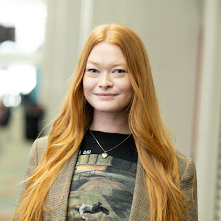

With great anticipation and excitement we are happy to announce that Chloe Gerhardson (she/her) has joined the Python Software Foundation (PSF) as of Monday May 23, 2022. Chloe joins the team as Infrastructure Engineer, led by PSF Director of Infrastructure Ee Durbin.

<table align="center" cellpadding="0" cellspacing="0"><tbody><tr><td></td></tr><tr><td>Chloe Gerhardson - PSF Infrastructure Engineer</td></tr></tbody></table>

As a recent graduate of Springfield Technical Community College’s associates program in Computer Programming, Chloe will be growing into a role that supports the wide gamut of software technologies that facilitate the technical aspects of our community.

In time Chloe will share in all responsibilities of the Infrastructure Team and help the PSF move its infrastructure commitment to the community from a reactive and maintenance stance towards progress on new and expanded services to fulfill our mission.

In her own words…

> I am thrilled and grateful to be brought along in the journey of growing and maintaining the PSF’s infrastructure, and I look forward to working with the PSF’s incredible staff members, as well as our wonderful community members at large.

Although excitement abounds for the learning, growing, and doing that this role requires Chloe also stays busy as a committed, registered, and active Registered Yoga Teacher in her community, skateboarder, dog lover, traveler, and aficionado of live music.

Please join us in welcoming Chloe!
