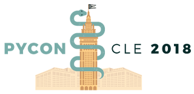
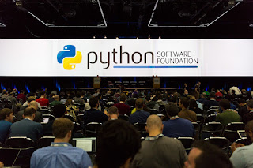

  
Sponsors help keep PyCon affordable and accessible to the widest possible audience. Sponsors are what make this conference possible. From low ticket prices to financial aid, to video recording, the organizations who step forward to support PyCon, in turn, support the entire Python community. They make it possible for so many to attend, for so many to be presenters, and for the people at home to watch along. The benefits of sponsorship are many - here are a few to consider:  

-   Being part of the biggest and most prestigious Python conference in the world.

-   Being matched with those who could potentially become clients.

-   Staying in front of your current customers - 3300+ attendees will see your products.
-   
Building relationships with the Python community - people look to sponsors to see who is using and supporting Python.

-   Recruiting - if you’re hiring, PyCon is the place to be.

-   A private meeting or interview room to conduct business onsite. 

-   The opportunity for innovators and practitioners in your company to talk about how you’re using Python.


Depending on your level of sponsorship, packages include complimentary conference passes, booth space, lead retrieval scanners, speaking opportunities, and a table in the Job Fair. We’re flexible and willing to work with you to design the sponsorship package to fulfill your business needs. Starting a discussion now is a great way to design a more custom program for you. Our sponsorship prospectus can be found here: [https://us.pycon.org/2018/sponsors/prospectus/](https://us.pycon.org/2018/sponsors/prospectus/) PyCon 2018  
Huntington Convention Center May 9th - May 17th, 2018 Cleveland, Ohio USA  
For more information please contact: pycon-sponsors@python.org  
 Photo by Mike Pirnat
