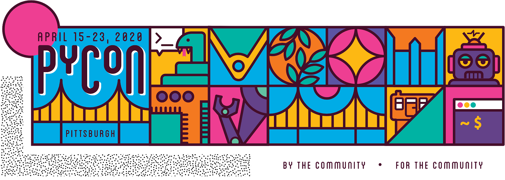

 Sponsors help keep PyCon affordable and accessible to the widest possible audience. Sponsors are what make this conference possible. From low ticket prices to financial aid, to video recording, the organizations who step forward to support PyCon, in turn, support the entire Python community. They make it possible for so many to attend, for so many to be presenters, and for the people at home to watch along. As a PyCon sponsor, your outreach to attendees begins before the conference even starts and lasts throughout the year. Your reach isn’t limited to the number of people who attend the conference itself. Following PyCon, you’ll continue to connect with the Python community through many touch points:  

-   Playback and Recorded PyCon Coverage: Over 17,000 people have subscribed to PyCon’s YouTube channel with over 723,000 views of either the keynotes or the recorded videos of PyCon 2018 sessions. Those videos continue to attract viewers today.
-   Conference Page and Announcement E-Lists: The PyCon home page has thousands of unique visitors every year and this year we’ll have an opt-in at signup for a newsletter to receive PyCon announcements.
-   Social Media: The PSF and PyCon Twitter accounts have more than 332,000 followers combined and thousands of followers of the PyCon speakers.

A Silver Sponsorship is a great low-cost option that includes (2) full passes and Job listing(s) on the Jobs Fair page! We also offer organizations with fewer than 25 employees a 30% discount for gold and silver sponsorships.  
**Check out the [new marketing and promotional opportunities](https://us.pycon.org/2020/sponsors/prospectus/) for 2020!**

We are also happy to customize a sponsorship package to give you the freedom to choose what you think works best in order to meet your event participation goals. Our sponsorship prospectus can be found [here](https://us.pycon.org/2020/sponsors/prospectus/). For more information please contact: [pycon-sponsors@python.org](mailto:pycon-sponsors@python.org)
