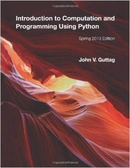

A couple of years ago, I discovered the edX MIT course 6.00x [Intro to Computer Science and Programming Using Python](https://www.edx.org/course/introduction-computer-science-mitx-6-00-1x-0#.VRSv3JPF8kU). At the time, I was eager to learn Python and CS basics, so I took the plunge. The course has been offered through edX each semester since, and at some point it was divided into two courses to allow more time for in-depth study, as the original one-semester course moved very quickly from basics to more advanced topics, such as *complexity classes, plotting techniques, stochastic programs, probability, random walks, and graph optimization.* I can’t say enough good things about the excellence of Professor John Guttag, who developed the course and wrote the accompanying textbook (which is recommended but not required), along with co-teachers, Profs. Eric Grimson and Chris Terman.  I was grateful at the time to have found a free introductory college-level course in computer science that uses Python, rather than C, Java, or another language, as I had already had some acquaintance with Python and wanted to solidify my foundation and gain more skill. Working through the course led me to appreciate the features of Python that make it a wonderful teaching language. Since it is relatively easy to learn, it allows the learner to get up and running quickly, to write code and get results early on, without getting too bogged down and discouraged (something that I, as a humanities rather than a math person, had experienced in the past.) In addition, Python teaches good programming habits, including the importance of good documentation, what Prof. Guttag frequently referred to as "good hygiene." I remember wondering at the time why Python wasn’t always the language taught to beginners. Well, today this is the trend. According to a July 2014 study by Phillip Guo, Python is Now the [Most Popular Introductory Teaching Language](http://cacm.acm.org/blogs/blog-cacm/176450-python-is-now-the-most-popular-introductory-teaching-language-at-top-us-universities/fulltext) at Top U.S. Universities. Guo analyzed the course curricula for the top 39 CS Departments in the US. He used U.S. News' ranking of best computer science schools in 2014, which begins with Carnegie Mellon, MIT, Stanford, and UC Berkeley (he stopped at 39 because apparently there was an 8-way tie for #40), and found that 27 of them teach Python in their Intro courses. Of the top 10 departments, the proportion was higher– 8 of them teach Python. The next most-taught languages the study found were (in descending order): Java, MATLAB, C, C+, Scheme, and Scratch. Moreover, in addition to edX, both Udacity and Coursera use Python for their introductory courses. Anecdotally, Guo found that professors in academic fields outside of CS are increasingly using Python to fill their students' needs for programming skills. See February’s PSF blog post [Python in Nature](http://pyfound.blogspot.com/2015/02/the-esteemed-international-scientific.html) for an explanation and example of this trend by Dr. Adina Howe, Professor of Agriculture and Biosystems Engineering at Iowa State University. The increasing popularity of Python as the language for introductory CS courses in the US will undoubtedly lead to further growth of the Python community and the language. As Guo explains:

> … the choice of what language to teach first reflects the pedagogical philosophy of each department and influences many students' first impressions of computer science. The languages chosen by top U.S. departments could indicate broader trends in computer science education, since those are often trendsetters for the rest of the educational community.

*I would love to hear from readers. Please send feedback, comments, or blog ideas to me at [msushi@gnosis.cx](mailto:msushi@gnosis.cx).*
